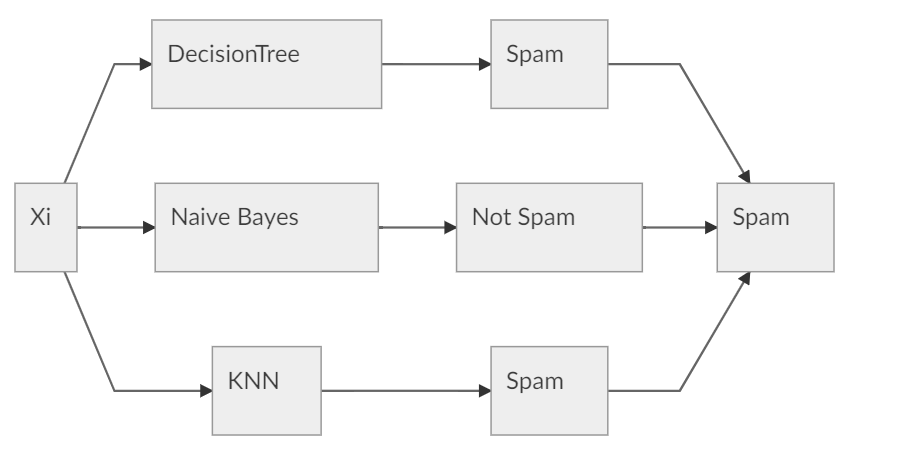
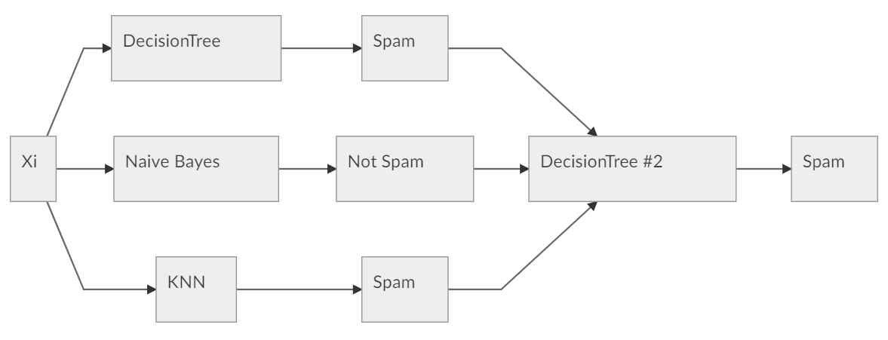

# CPSC340 Reviews
## Table of Contents
- [CPSC340 Reviews](#cpsc340-reviews)
  - [Table of Contents](#table-of-contents)
  - [Basics](#basics)
    - [Steps for Data Mining](#steps-for-data-mining)
    - [Features](#features)
      - [Type of features](#type-of-features)
        - [Categorical Features](#categorical-features)
        - [Numerical Features](#numerical-features)
      - [Convert Features](#convert-features)
      - [Feature Aggregation](#feature-aggregation)
      - [Feature Selection](#feature-selection)
      - [Feature Transformation](#feature-transformation)
    - [Analize Data](#analize-data)
      - [Categorical Summary Statistics](#categorical-summary-statistics)
      - [Outliers](#outliers)
      - [Entropy as Measure of Randomness](#entropy-as-measure-of-randomness)
      - [Distance and Similarity](#distance-and-similarity)
      - [Limitations](#limitations)
    - [Visualization](#visualization)
      - [Basic Plots](#basic-plots)
  - [Supervised Learning](#supervised-learning)
    - [Naive Method: Predict Mode](#naive-method-predict-mode)
    - [Decision Trees](#decision-trees)
      - [Decision Stump](#decision-stump)
      - [Measure of goodness: Accuracy score](#measure-of-goodness-accuracy-score)
      - [Greedy recursive splitting](#greedy-recursive-splitting)
    - [IID Assumptions.](#iid-assumptions)
    - [Training vs Test Error](#training-vs-test-error)
    - [Validation Error](#validation-error)
    - [Optomization bias](#optomization-bias)
    - [Cross Validation](#cross-validation)
    - [Probabilistic Classifiers](#probabilistic-classifiers)
      - [naive Bayes](#naive-bayes)
    - [KNN](#knn)
      - [K on fundamental trade-off](#k-on-fundamental-trade-off)
      - [Charasteristics](#charasteristics)
      - [Problems](#problems)
      - [Parametric vs. Non-Parametric Models](#parametric-vs-non-parametric-models)
    - [Norms](#norms)
    - [Encouraging Invariance](#encouraging-invariance)
    - [Ensemble Method](#ensemble-method)
      - [Types of Ensemble Method](#types-of-ensemble-method)
      - [Averaging](#averaging)
        - [Random Forests](#random-forests)
  - [Unsupervised Learning](#unsupervised-learning)
    - [Clustering](#clustering)
      - [K-means](#k-means)
        - [Cost of K-Means](#cost-of-k-means)
        - [Application of K-means](#application-of-k-means)


## Basics

### Steps for Data Mining
    
1) Identify data mining task. 
3) Collect data.
4) Clean and preprocess the data. 
5) Transform data or select useful subsets. 
6) Choose data mining algorithm. 
7) Data mining! 
8) Evaluate, visualize, and interpret results. 
9) Use results for profit or other goals

### Features
#### Type of features
##### Categorical Features
The features that is not a number, like job and city. 
##### Numerical Features
The Feature that is a number
#### Convert Features
- Categorized
		Make category as a number.
- Text
		Bag of Words
- Graph
		Grayscale intensity
		Adjacency Matrix
#### Feature Aggregation
Combine features to form new features.
e.g. City to Provinces
#### Feature Selection
Remove irrelevent feature
#### Feature Transformation
- Discretization
		Make continuous data to categories.
- Square, exponentiation, logarithm...
- Scaling

### Analize Data
#### Categorical Summary Statistics
- Mean: average value. 
- Median: value such that half points are larger/smaller. 
- Quantiles: value such that ‘k’ fraction of points are larger
- Range: minimum and maximum values. 
- Variance: measures how far values are from mean.  (Square root of variance is “standard deviation”)
- Intequantile ranges: difference between quantiles.
#### Outliers
Mean and std is more sensitive to ourliers.

#### Entropy as Measure of Randomness
- Low entropy means “very predictable”. 
- High entropy means “very random”
- For $k$ values Minimum value is 0, maximum value is $\log(k)$.
- For continuous dataset, normal distribution has highest entropy
- For categorical dataset: uniform distribution has highest entropy.

#### Distance and Similarity
- Hamming distance: Number of elements in the vectors that aren’t equal. 
- Euclidean distance:  How far apart are the vectors? 
-  Correlation:  Does one increase/decrease linearly as the other increases?  Between -1 and 1.

#### Limitations
Summary statistic can be misleading. Dataset that are very different can have same summary statistic.

### Visualization

#### Basic Plots
- Histogram
- Box Plot
- Matrix Plot 
May be able to see trends in features.
- Scatterplot

## Supervised Learning
Take features of examples and corresponding labels as inputs.
And Find a model that can accurately predict the labels of new examples.
- Input for an example is a set of features. 
- Output is a desired class label.

### Naive Method: Predict Mode
Always Predict the mode.
### Decision Trees
#### Decision Stump
A simple decision tree with 1 spliting rules:

If feature $x >x_0$ 
	predict $y_0$ 
otherwise 
	predict $y_1$
	
	
This will take $O(ndk)$ with an instance of $n$ examples, $d$ features and $k$ thresholds.
$O(nd)$ if all features are binary.
$O(n^2d)$ if all our features have unique values. 
#### Measure of goodness: Accuracy score
Score = $\frac{\text{Correct Inputs}}{\text{Total number of Examples}}$

#### Greedy recursive splitting
 1. Find the decision stump with the best score (information gain).
 2. Find the decision stump with the best score on the two new datasets.
 3. Stop if all leaves have the  same label, or reaches the maximum depth.
 
### IID Assumptions.
Usually we would Assume that the training set and test set follows:

- All examples come from the same distribution
- The example are sampled independently

### Training vs Test Error
Test Error = Approximation Error + Training Error

- **Simple model** might have a high training Error but have a low approximation error.
- **Complex model** might have a low trainging Error but have a high approximation error.

e.g. The deeper the decision tree is the more complex it is. If we have a decision tree with depth $\infty$, every thing in training set will be classified correctly. But it might perform poorly in Test Set.

### Validation Error
We can use part of training data to approximate the test error, helping us pick the hyper parameter.
But if we look use the validation set too much, we might introduce optimization bias.

### Optomization bias
We might tried too many models on the validation set too much and by chance one of them accidently have a low validation error. So we **overfit** the validation set.

e.g. Consider a multiple choice test with 10 questions.
Fill a exam randomly, expect grade => 25%
Fill 2 exams randomly, expect max grade => 33%
Fill 10000 exams randomly, expect max grade => 82%

- **Optimization bias is small if you only compare a few models.**
- **Optimization bias shrinks as you grow size of validation set.**

### Cross Validation
Split the trainging data to k parts. Train the model on k-1 parts, and compute the validation error on the other part.
Take the average of the k errors to approxmate the test error.

**As k get larger, the result gets more accurate but more expensive**

### Probabilistic Classifiers
#### naive Bayes
- ***Identify spam emails***
Here, $X_i$ is features of the email (bag of words).
<br>v1 = $p(y_i =\text{spam}|x_i) = \frac{p(x_i|y_i=\text{spam})p(p_i = \text{spam})}{p(x_i)}$
<br> v2 = $p(y_i = \text{not spam}|x_i) = \frac{p(x_i|y_i=\text{not spam})p(p_i = \text{not spam})}{p(x_i)}$
We would compare the value of v1 and v2, if v1 > v2 we say it is spam. Otherwise, not spam.
But $p(x_i|y_i=\text{spam})$ is hard to compute, so we assume that each word is independent. That is <br>
$p(x_i|y_i=\text{spam}) = \prod_{j=0}^d p(x_i^j|y)$


- Laplace Smoothing
Fix the problem that if you have no training example with that feature value, will result in a 0 probablility.
<br>$\frac{\text{\#Spam message with w}+1}{\#Spam messages +2}$

### KNN
For a new example x, predict it with the same value as the training example that is nearest to it.

- Model gets more complicated as ‘k’ decreases.
- Model gets more complicated as ‘n’ increases.

#### K on fundamental trade-off
As ‘k’ grows, training error increase and approximation error decreases.

#### Charasteristics
- No training phase
- Predictions are expensive: O(nd) for one example.
- Storage is expensive: Store all training data.

#### Problems
- Features have very different scales
- Need exponentially more points to ‘fill’ a high-dimensional volume.
#### Parametric vs. Non-Parametric Models
- **Parametric**
Have fixed number of parameters: trained “model” size is O(1) in terms ‘n’.
e.g. Decision Tree
- **Non-Parametric**
Number of parameters grows with ‘n’: size of “model” depends on ‘n’

e.g. KNN

### Norms
- L1 Norm
	$\| r\|_1 = \sum_{j=1}^d|r_j|$
- L2 Norm
$\| r\|_2 = \sqrt{\sum_{j=1}^d|r_j^2|}$
- L$\infty$ Norm
$\| r\|_\infty = \max\{|r_j|\}$

### Encouraging Invariance
Add transformed data during training to avoid small translation during tests.

### Ensemble Method
Classifiers that have classifiers as input.
- Often have higher accuracy than input classifiers.
#### Types of Ensemble Method
- Boosting (improve trainging error)
- Averaging (improves approximation error)

#### Averaging
- Input to averaging is the predictions of a set of models
- If the models make independent errors. The chanses that the averaing is wrong is lower than other models.
1. A simple model of averaging: Take mode of predictions.

2. Stacking


##### Random Forests
Average a set of deep decision trees. 

- Generate Trees with independent Errors
  - Bootstrap Sampling <br> Generate several bootstrap samples an d fit classifier to each boot strap sample. Average the prodictions.
  - Random Trees <br> For each split in a random tree model, randomly sample a small number of possible features, and condider these random features for spliting.


## Unsupervised Learning
### Clustering
- Input: set of examples described by features $x_i$
- Output: an assignment of examples to ‘groups’.
- Goal: 
  - Examples in the same group should be ‘similar’.
  - Examples in different groups should be ‘different’.


#### K-means
- Input:
  - The number of clusters ‘k’ (hyper-parameter).
  - Initial guess of the center (the “mean”) of each cluster.

```
1. Assign each data point to closest mean.
2. Update the means bases on the assignment.
3. Repead untill convergence.

When get a new test example, assign it to the nearest mean.
```

**Note:**

K-Means is Garenteed to converge.

**Issues:**

Each example is assigned to one (and only one) cluster.

It may converge to sub-optimal solution. 

**Solusion:**

Try several different random start points and choose the best.

##### Cost of K-Means
$O(ndk)$

##### Application of K-means
Represent the data with the cluster means.
